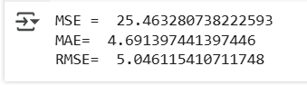

# Implementation-of-Simple-Linear-Regression-Model-for-Predicting-the-Marks-Scored

## AIM:
To write a program to predict the marks scored by a student using the simple linear regression model.

## Equipments Required:
1. Hardware – PCs
2. Anaconda – Python 3.7 Installation / Jupyter notebook

## Algorithm
1. Import the standard Libraries
2. Set variables for assigning dataset values.
3. Import linear regression from sklearn.
4. Assign the points for representing in the graph

## Program:
Developed By : HARISHKUMAR R
Register No  : 212223230073
```py
import pandas as pd
import numpy as np
import matplotlib.pyplot as plt
from sklearn.metrics import mean_absolute_error,mean_squared_error
df=pd.read_csv('/content/student_scores.csv')
df.head()
```


```py
df.tail()
```

```py
x=df.iloc[:,:-1].values
x
```

```py
y=df.iloc[:,1].values
y
```

```py
from sklearn.model_selection import train_test_split
x_train,x_test,y_train,y_test=train_test_split(x,y,test_size=1/3,random_state=0)

from sklearn.linear_model import LinearRegression
regressor=LinearRegression()
regressor.fit(x_train,y_train)
y_pred=regressor.predict(x_test)
y_pred
```

```py
y_test
```

```py
plt.scatter(x_train,y_train,color="red")
plt.plot(x_train,regressor.predict(x_train),color="purple")
plt.title("Hours vs Scores(Training Set)")
plt.xlabel("Hours")
plt.ylabel("Scores")
plt.show()
```

```py
plt.scatter(x_test,y_test,color="red")
plt.plot(x_test,regressor.predict(x_test),color="purple")
plt.title("Hours vs Scores(Test Set)")
plt.xlabel("Hours")
plt.ylabel("Scores")
plt.show()
```

```py
mse=mean_squared_error(y_test,y_pred)
print('MSE = ',mse)
mae=mean_absolute_error(y_test,y_pred)
print('MAE= ',mae)
rmse=np.sqrt(mse)
print("RMSE= ",rmse)
```


## Result:
Thus the program to implement the simple linear regression model for predicting the marks scored is written and verified using python programming.
